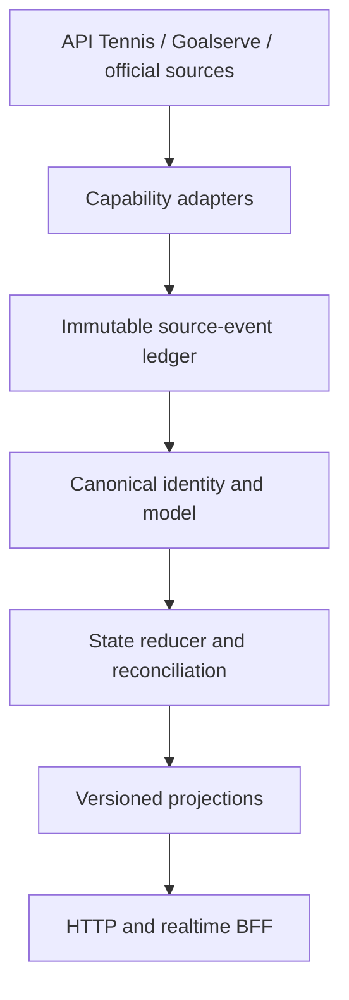

# Live Score V2 Architecture

Status: **Phase 0 target contract**
Scope: live scores first; draws, historical H2H, rankings, and player profiles
reuse the same platform contracts.

## Outcome

Live Score V2 is a modular monolith and event-driven data pipeline:



The architecture is successful when every published field can answer:

- which source supplied it;
- when the source said it changed;
- when the platform observed it;
- which schema and policy interpreted it;
- why it won reconciliation;
- whether an operator correction applies.

## Constraints and deliberate non-goals

- Runtime: Node.js with TypeScript `strict` for new V2 modules.
- Validation: schemas at every adapter boundary (Zod is the planned default).
- Persistence: Postgres for durable events/state and Redis for ephemeral
  coordination/cache.
- Deployment unit: one modular monolith. Workers and API processes may run
  separately from the same codebase.
- No microservices, Kafka, or Kubernetes at the current scale.
- No direct provider access from the web or mini program.
- Phase 0 does not change production behavior or create fictional raw fixtures.

## Modules and dependency direction

Planned directories are isolated from the frozen V1 `src/` tree:

```text
v2/
└── src/
    ├── domain/
    │   ├── models/
    │   ├── states/
    │   ├── policies/
    │   └── invariants/
    ├── adapters/
    │   ├── api-tennis/
    │   ├── goalserve/
    │   ├── atp-official/
    │   ├── wta-official/
    │   └── itf-official/
    ├── ingestion/
    │   ├── scheduler/
    │   ├── websocket/
    │   └── source-health/
    ├── identity/
    ├── reconciliation/
    ├── projections/
    ├── api/
    └── ops/
```

Allowed dependency flow:

```text
domain <- identity/reconciliation <- projections <- api
   ^              ^
   |              |
adapter -> ingestion/event ledger
```

Rules:

- `domain` has no provider, network, persistence, cache, API, projection, or UI
  dependency.
- `adapters` may use canonical input types but cannot write projections or decide
  page behavior.
- `identity` produces canonical IDs and confidence decisions; it never rewrites
  raw events.
- `reconciliation` is deterministic for a fixed ordered event set, policies,
  mappings, and overrides.
- `projections` derive page-oriented read models and contain no raw provider
  fields.
- `api` reads projections and publishes versioned snapshots/deltas.
- Side effects are kept in adapters, ingestion, persistence, API transports, and
  operations modules.

Phase 0 enforces part of this contract through
`test/architecture-boundaries.test.mjs`; the gate must expand as modules land.

## Capability adapters

A provider is a set of small capabilities, not one universal client:

```ts
interface LiveScoreSource {}
interface ScheduleSource {}
interface DrawSource {}
interface MatchStatsSource {}
interface PlayerSource {}
interface OfficialRankingSource {}
interface LiveRankingSource {}
interface RaceRankingSource {}
interface RankingPointsCompositionSource {}
interface HistoricalMatchSource {}
```

Capability acceptance matrix:

| Capability | Canonical input/output | Candidate source | Coverage declaration | Collection frequency | Honest degradation | Projection | Required fixture | Production gate |
|---|---|---|---|---|---|---|---|---|
| Live score | score/status observations → match reducer | commercial live feed | point/game/set/result/none | stream or ≤8s poll while observed | retain last state + stale `asOf` | `TodayScoresView`, `MatchDetailView` | normal, interrupted, terminal, empty, stale/out-of-order | replay invariants + latency/coverage shadow report |
| Schedule | schedule observations → canonical match identity | commercial schedule + official OOP | history window, stages, draws | active/current/future policy | retain accepted schedule + missing-source warning | `TodayScoresView` | cross-midnight, postponement, LL/Q/WC, cancellation | ≥99.9% in-contract coverage with explicit denominator |
| Draw | versioned draw snapshot/tree | official or proven commercial | full/partial/none per draw/stage | publication/revision polling | partial tree with gaps, no inferred branches | `TournamentDrawView` | qualifying/main draw, replacement, round robin, team tie | structural reconciliation and revision tests |
| Match stats | canonical stat snapshot | commercial/official stats | live/post-match/none + field list | live/post-match policy | omit unavailable fields | `MatchStatsView` | live and post-match snapshots | schema, consistency, latency and source provenance |
| Player profile | field-level entity evidence | official/commercial profiles | fields and freshness | scheduled + on-demand | unknown field with provenance gap | `PlayerProfileView` | same-name/conflict/profile update | high-confidence identity or explicit partial |
| Official ranking | dated immutable ranking snapshot | ATP/WTA official | tour, type, date, depth | official publication cadence | previous snapshot labelled stale | `OfficialRankingView` | full snapshot + correction | total/order checks and official reconciliation |
| Live ranking | points-ledger projection | internal ledger or accepted supplier | eligible events/players/as-of | event driven | partial/blocked when ledger coverage incomplete | `LiveRankingView` | points add/drop/correction | ledger replay and official checkpoint reconciliation |
| Race/championship ranking | season-points projection | internal ledger or accepted supplier | season/rules/events/as-of | event driven | partial/blocked with coverage gaps | `RaceRankingView` | season boundary/tie/correction | policy version and official checkpoint reconciliation |
| Points composition | earning/defending ledger → breakdown | internal ledger + official evidence | event/result/expiry completeness | event driven + weekly expiry | list known items; no definitive total if gaps | `PlayerPointsCompositionView` | earn/defend/drop/replace/correction | sum invariant and ranking-total reconciliation |
| Historical match | canonical historical results → scoped aggregate | commercial + ATP/WTA/ITF evidence | authority/circuit/date/discipline gaps | backfill + daily increment | partial/unknown, never false 0–0 | `H2HView` | ITF/qualifying/retired/walkover/duplicate identity | completeness proof for every claimed scope |

Every adapter:

1. receives or fetches provider data;
2. validates its raw schema at entry;
3. appends the raw envelope before interpretation;
4. maps valid input to canonical observations;
5. declares timestamps, sequence, schema version, capability, and coverage;
6. owns retry, rate limiting, reconnect, and provider-health signals.

It cannot determine a terminal state, display date, translation, UI order, or
delete a match because the provider returned nothing.

## Immutable source-event ledger

The minimum envelope is:

```ts
type SourceEvent = {
  id: string;
  provider: string;
  capability:
    | 'live_score'
    | 'schedule'
    | 'draw'
    | 'match_stats'
    | 'player_profile'
    | 'official_ranking'
    | 'live_ranking'
    | 'race_ranking'
    | 'points_composition'
    | 'historical_match';
  kind:
    | 'snapshot'
    | 'delta'
    | 'correction'
    | 'empty_response'
    | 'error'
    | 'document';
  sourceEntityId?: string;
  observedAt: string;
  sourceUpdatedAt?: string;
  sequence?: number;
  schemaVersion: string;
  payloadHash: string;
  acquisition: {
    method: 'http' | 'websocket' | 'file' | 'manual_import';
    endpointLabel: string;
    capturedAt: string;
  };
  payload:
    | { storage: 'inline_json'; value: unknown }
    | {
        storage: 'object_ref';
        objectKey: string;
        mediaType: 'application/json' | 'application/pdf';
        bytes: number;
      };
};
```

Source events are append-only and deduplicated by a documented idempotency key.
Large official documents such as ATP OOP PDFs are stored as immutable object
references with content hash, size, media type, and acquisition metadata; the
ledger never stores an unaudited mutable URL as the evidence itself.
Corrections and operator overrides are additional records. A replay selects an
event range, schema/policy versions, mappings, and overrides, then rebuilds state
and projections without requesting the upstream provider again.

## Write and read paths

Write path:

1. Adapter observes a payload.
2. Envelope and raw payload are durably appended.
3. Validation failure goes to quarantine and affects source health.
4. Valid observations resolve canonical identity.
5. Reducers enforce match and source-health invariants.
6. Reconciliation chooses field values with provenance.
7. Projections publish monotonically increasing versions.

Read path:

1. Client obtains a complete projection snapshot.
2. Realtime transport emits versioned deltas.
3. Client discards versions older than its current version.
4. Client refreshes the snapshot every 30–60 seconds and after reconnect.
5. Stale or partial coverage is displayed explicitly.

Initial projections:

- `TodayScoresView`
- `MatchDetailView`
- `TournamentDrawView`
- `PlayerProfileView`
- `H2HView`
- `MatchStatsView`
- `OfficialRankingView`
- `LiveRankingView`
- `RaceRankingView`
- `PlayerPointsCompositionView`

Official weekly ranking, live ranking, race/championship ranking, and player
points composition are separate capabilities backed by explicit snapshot/ledger
contracts. A source implementing one is not assumed to implement the others, and
their acceptance/coverage is measured independently.

## Legacy migration

`poller.mjs`, `official-validator.mjs`, and `normalizer.mjs` are frozen during
Phase 0 by content hash. They are sources of observed behavior, not the V2
architecture.

Migration uses a strangler approach:

1. preserve existing behavior tests;
2. wrap API Tennis behind the first adapter;
3. append events while V1 still serves users;
4. build and replay V2 state in shadow mode;
5. compare V1 and V2 projections;
6. cut over behind a rollback switch only after release gates pass.

The hotfix commit `7c8fe48` is not merged wholesale. Its new tests are tracked in
the fixture migration registry so the incidents remain visible without importing
its additional legacy production branches.

## Operational design

- Provider health is independent from match state.
- Failed schema validation is quarantined with metrics and alerting.
- Identity ambiguity and unknown competition policy enter review queues.
- Manual overrides include reason, operator, time, scope, and expiry.
- Every incident records source-event IDs and becomes a replayable regression.
- Metrics use the five timestamps defined in `SLO_AND_RELEASE_GATES.md`.
