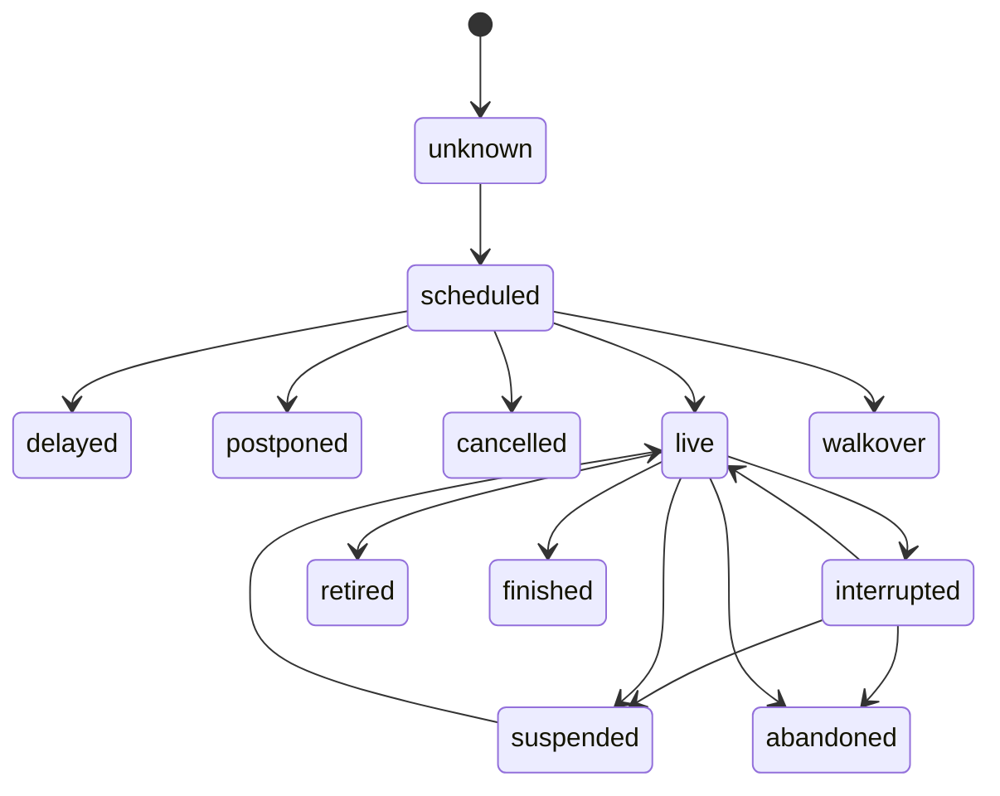
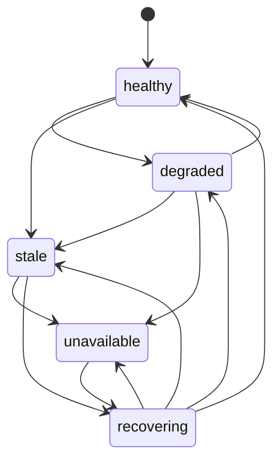

# Match and Source-Health State Machines

Status: **Phase 0 behavioral contract**

Match state and provider health are separate. A missing or failed source response
cannot by itself change a match.

## Match states



Canonical states:

```ts
type MatchStatus =
  | 'unknown'
  | 'scheduled'
  | 'delayed'
  | 'postponed'
  | 'live'
  | 'interrupted'
  | 'suspended'
  | 'cancelled'
  | 'walkover'
  | 'retired'
  | 'abandoned'
  | 'finished';
```

State distinctions:

- `interrupted`: play/feed is temporarily interrupted and may resume without an
  official next-date decision; it is non-terminal.
- `suspended`: an authority/source explicitly suspends play pending resumption;
  it is non-terminal.
- `cancelled`: the match is cancelled before meaningful play and will not
  produce a winner under this match identity; it is terminal.
- `abandoned`: play began but the match is terminated without a normal
  winner/result; it is terminal.
- `withdrawal`: a participant/slot availability event, not by itself a match
  status. Before play it can produce a replacement while the match remains
  scheduled, a `walkover` if the opponent advances, or `cancelled` if no match
  is awarded. After play begins, it maps to `retired` only with official result
  evidence.

A pre-match withdrawal never becomes `retired`. If no play began, it resolves
only as replacement, walkover, or cancellation. A late authoritative retirement
result may jump from `unknown`/`scheduled`/`delayed`/`postponed` to `retired`
only when the observation carries proof that play began: a non-zero score
snapshot or an official retirement result tied to the same match identity.

`finished`, `retired`, `walkover`, `cancelled`, and `abandoned` are terminal for
ordinary observations. An official correction is a distinct event type and is
the only normal route out of a terminal state. A rescheduled replacement after
cancellation may be a new canonical match unless correction evidence explicitly
preserves identity.

## Complete ordinary transition table

Same-state observations may enrich fields without a transition. All ordinary
status changes not listed below are denied and recorded for reconciliation. An
authoritative result may skip unobserved intermediate states only where listed.

| Current | Allowed ordinary next states | Required guards | Score action | Projection/display |
|---|---|---|---|---|
| `unknown` | `scheduled`, `delayed`, `postponed`, `live`, `interrupted`, `suspended`, `walkover`, `cancelled`, `retired`, `abandoned`, `finished` | identity resolved enough to attach evidence; direct terminal authoritative; direct retirement proves play began | accept only internally consistent available snapshot | show known facts and coverage; never synthesize 0–0 |
| `scheduled` | `delayed`, `postponed`, `live`, `walkover`, `cancelled`, `retired`, `abandoned`, `finished` | event identity must match; live/result authoritative; retirement requires play-start proof and cannot come from withdrawal | live accepts one-source score snapshot; pre-match statuses preserve absent score | scheduled/delay/postpone message with `asOf`; terminal reason when known |
| `delayed` | `scheduled`, `postponed`, `live`, `walkover`, `cancelled`, `retired`, `abandoned`, `finished` | newer evidence; retirement requires play-start proof and cannot come from withdrawal | preserve score unless a valid new snapshot exists | keep match visible; delay is not source outage |
| `postponed` | `scheduled`, `delayed`, `live`, `walkover`, `cancelled`, `retired`, `abandoned`, `finished` | newer official evidence; retirement requires play-start proof and cannot come from withdrawal | preserve played score if postponement follows interruption | show new date or TBD; retain official-day provenance |
| `live` | `interrupted`, `suspended`, `retired`, `abandoned`, `finished` | monotonic source time/sequence; terminal requires winner/reason rules | score/game/server accepted atomically; legal monotonicity required | live or last accepted score; source staleness shown separately |
| `interrupted` | `live`, `suspended`, `postponed`, `retired`, `abandoned`, `finished` | resumption continuity or authoritative terminal/postpone evidence | freeze last accepted score until consistent resume/result | show interrupted and last update, not scheduled/0–0 |
| `suspended` | `live`, `interrupted`, `postponed`, `retired`, `abandoned`, `finished` | explicit resume/status evidence from accepted authority | freeze last accepted score; resume must continue legally | show suspended and resume/date information if known |
| `walkover` | none | terminal lock | no played score is fabricated | show walkover/winner and provenance |
| `cancelled` | none | terminal lock | do not fabricate winner or played score | hidden/visible choice belongs to projection, while canonical record remains |
| `retired` | none | terminal lock | preserve played score; official winner/reason required | show retirement, winner, final accepted score |
| `abandoned` | none | terminal lock | preserve played score; no normal winner invented | show abandoned and last accepted score |
| `finished` | none | terminal lock | final score/winner internally consistent or quarantined | show final result and `asOf` |

`correction` is not an ordinary transition. It may replace any status only when
authorized by source policy, tied to affected evidence, reasoned, and replayed.
Unlisted transitions—including `finished → live`, `cancelled → scheduled`, and
`retired → live`—are denied without correction.

For every denied transition the reducer preserves the previous canonical match,
records a rejection reason/source event, and may degrade source health. A
correction records prior/replacement status and score, authority/override,
evidence, effective time, and policy version; replay then rebuilds projections.
The UI never applies a correction packet directly.

## Reducer contract

```ts
nextState = reduceMatch(previousState, observation, policy)
```

For fixed inputs the reducer is pure and deterministic. It performs no clock,
network, database, cache, translation, logging, or UI operation.

The reducer is also the only status-construction boundary. A canonical match
stores the opaque `ReducedMatchStatus`; raw observations and page DTOs use the
readable `MatchStatus`. Direct or constant-resolved `status` assignment,
status-targeted `Object.defineProperty`/`Object.defineProperties`/`Reflect`
set/define/delete operations, deletion, and direct status-brand type assertions
outside the reducer are CI failures. Dynamic writes to ordinary typed maps and
non-status meta operations are not state mutations and remain legal.

When the reducer is implemented, every accepted canonical snapshot it returns
must be runtime-frozen before publication. Reducer tests must prove that the
match, status-bearing object, score, sides, and nested collections cannot be
mutated after return; the exact deep-freeze boundary will be fixed in the
reducer ADR rather than improvised by adapters or projections.

Required invariants:

1. Empty source responses emit no match observation.
2. Missing fields mean unknown/no update, not zero or empty score.
3. An older source timestamp cannot overwrite a newer accepted observation from
   the same authority/sequence.
4. Duplicate events are idempotent.
5. An ordinary observation cannot regress a terminal state.
6. Sets and games cannot decrease unless an accepted correction explicitly
   replaces the affected snapshot.
7. Score, current game, and server are accepted as one internally consistent
   source snapshot; fields from unrelated providers are not spliced together.
8. Match identity and schedule facts are not mutated by a live-score packet.
9. A provider event ID change does not create a second match when canonical
   pairing/evidence resolves it to an existing match.
10. Replaying the same source events, mappings, policies, and overrides produces
    byte-equivalent canonical state and projection versions.

Out-of-order events may be sorted only by documented source sequence/timestamp
rules. Arrival order remains recorded for diagnosis.

## Observations

An observation is provider-neutral and includes:

```ts
type MatchObservation = {
  canonicalMatchId?: string;
  sourceEventId: string;
  observedAt: string;
  sourceUpdatedAt?: string;
  sequence?: number;
  kind:
    | 'schedule'
    | 'score_snapshot'
    | 'status'
    | 'result'
    | 'participant_withdrawal'
    | 'correction';
  value: unknown;
  coverage: Coverage;
};
```

An adapter emits observations but cannot reduce them. Failed schema validation,
HTTP errors, disconnects, and empty collections are source-health signals.

## Source-health states



Definitions:

- `healthy`: observations arrive within capability-specific SLOs.
- `degraded`: elevated errors, partial payloads, or reduced coverage.
- `stale`: no usable update inside the configured freshness window.
- `unavailable`: repeated failure/disconnect or explicit outage threshold.
- `recovering`: data resumed but continuity/reconciliation checks are pending.

Health transitions can change `coverage`, `asOf`, warnings, polling/backoff, and
source selection. They do not reset score or status.

Complete health transition policy:

| Current | Allowed next states |
|---|---|
| `healthy` | `degraded`, `stale` |
| `degraded` | `healthy`, `stale`, `unavailable` |
| `stale` | `recovering`, `unavailable` |
| `unavailable` | `recovering` |
| `recovering` | `healthy`, `degraded`, `stale`, `unavailable` |

Same-state health observations update counters/timestamps. Unlisted transitions
are denied so that an unavailable source cannot become healthy on one packet
before schema, freshness, and continuity checks complete.

## Corrections

A correction records:

- the event and fields being corrected;
- the authoritative source or operator override;
- the previous accepted value;
- the replacement value;
- reason and evidence;
- effective and observation times.

Corrections rebuild downstream state through replay. Direct production-state
edits are prohibited.

## Required golden and property tests

Before a V2 reducer can affect users, tests must cover real sanitized examples
for normal finish, walkover, retirement, suspend/resume, abandonment,
postponement, cross-midnight play, replacement participant, doubles, duplicate
names, ITF, junior, empty responses, delayed events, and upstream correction.

Property/invariant tests must prove:

- terminal non-regression;
- duplicate idempotence;
- stale update rejection;
- legal score monotonicity;
- deterministic replay;
- no match deletion caused by an empty response.
